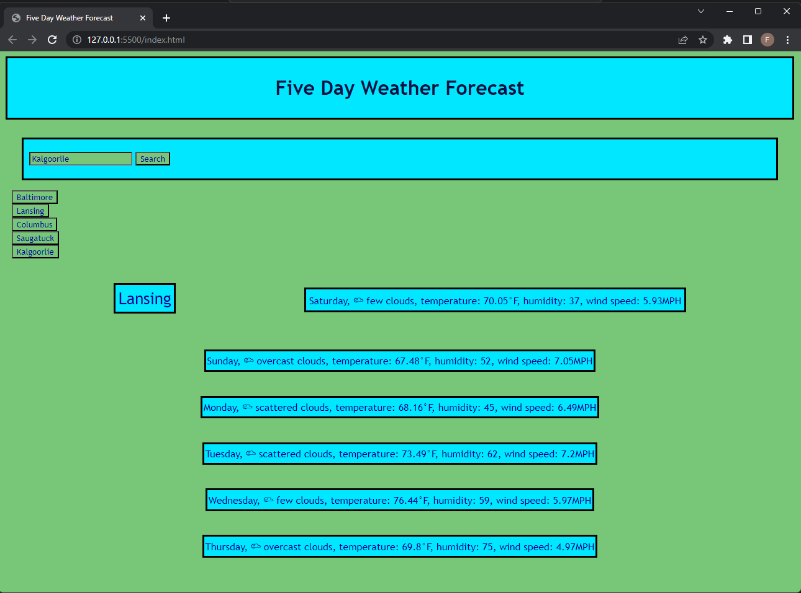

# Weather App

The Weather App is a browser-based app that provides the user with an accurate weather report for any city in the world. When the user inputs a city name, the app displays current weather conditions for that city, and a weather forecast for that location for the next five days in the browser window.

## About

Weather App utilizes the openweather.org API to retrieve weather reports. https://openweathermap.org/

## Usage

Enter a city's name in the search bar to see the 5 day report. The top card will show current conditions, and the subsequent cards will show the report for the next 5 days (chronologically, left to right, top to bottom)

Click on one of the five 'search history' buttons on the left to see a fresh 5-day report for that city.

## Screencap

<h3 style="text-align: center;">The site in a normalized Chrome window:</h3>
 

## Future development

Although Weather App has succeeded magnificently in its task— a true paragon of perfection!— there is still room for future growth and improvement:

* Add labels to the days for clarity, polish the layout, and other cosmetic improvements

* Allow for different cities with the same name - currently, it is impossible to search for London, Ontario or for Toledo, Spain

* Use event listeners properly, instead of using `onclick` and `onkeydown` in the HTML

* Add 'delete' functionality to search history buttons - currently, once the user searches 5 cities, those 5 will remain their indelible history for all eternity

* Expand the icon library, and add functionality for a set of 'daytime' and 'nighttime' icons - use openweathermap's own icons: https://openweathermap.org/weather-conditions

* Hide the API keys

* javascript should be used to populate the HTML with the search history buttons (instead of them just starting there)

* condense the code - a lot of things are sprawling lists, when they should be loops

## Lisence

GNU General Public License v3.0 