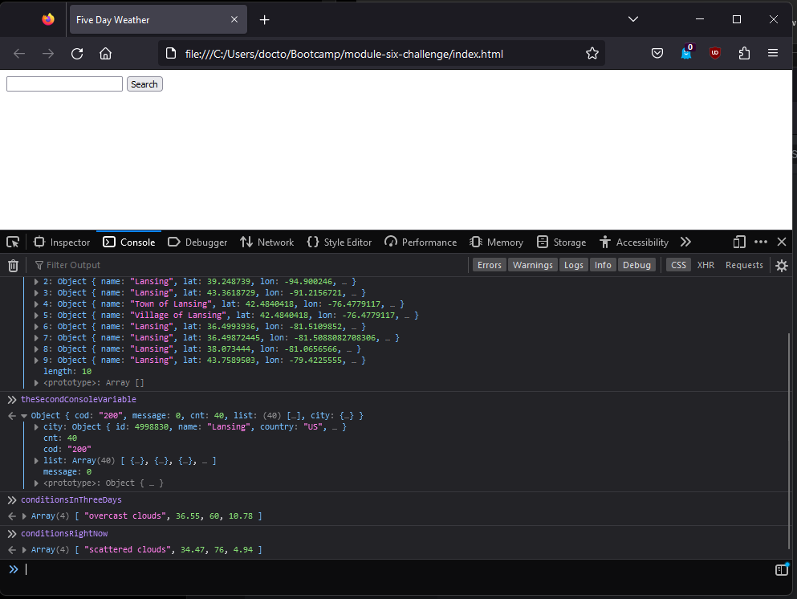

# Weather App

The user inputs a city, and the app outputs a weather forecast for that location for the next five days

## About

This is a placeholder submission!

I'm told that we can re-submit homework assignments well after the due date. I hope that this is true, but, just in case it's false, I am submitting this 'better than nothing' version for now. (I fully intend to submit a finished version of the assignment in the future).

To see what I've done so far, give the prompt a city name, and query the console about 'theFirstConsoleVariable' and/or 'theSecondConsoleVariable'

## Screencap

<h3 style="text-align: center;">The site with the console open:</h3>
 

module-six-placeholder-screencap.png

## Future development

Although Weather App has succeeded magnificently in its task— a true paragon of perfection!— there is still room for future growth and improvement:

Add cute icons to the text output that reflect the current conditions

Allow for different cities with the same name - currently, it is impossible to search for London, Ontario or for Toledo, Spain

Use event listeners properly, instead of using `onclick` and `onkeydown` in the HTML

Add 'delete' functionality to search history buttons - currently, once the user searches 5 cities, those 5 will remain their indelible history for all eternity

javascript should be used to populate the HTML with the search history buttons (instead of them just starting there)

## Acceptance criteria (for my personal reference)

AS A traveler

I WANT to see the weather outlook for multiple cities

SO THAT I can plan a trip accordingly

GIVEN a weather dashboard with form inputs

WHEN I search for a city

THEN I am presented with current and future conditions for that city and that city is added to the search history

WHEN I view current weather conditions for that city

THEN I am presented with the city name, the date, an icon representation of weather conditions, the temperature, the humidity, and the the wind speed

WHEN I view future weather conditions for that city

THEN I am presented with a 5-day forecast that displays the date, an icon representation of weather conditions, the temperature, the wind speed, and the humidity

WHEN I click on a city in the search history

THEN I am again presented with current and future conditions for that city

## Grading rubrik

20% - Uses the OpenWeather API to retrieve weather data

20% - Uses localStorage to store persistent data

8% - Application deployed at live URL

8% - Application GitHub URL submitted

8% - GitHub repository that contains application code

5% - Application user experience is intuitive and easy to navigate

5% - Application user interface style is clean and polished

5% - Application resembles the mockup functionality provided in the Challenge instructions

2% - Repository has a unique name

2% - Repository follows best practices for file structure and naming conventions

3% - Repository follows best practices for class/id naming conventions, indentation, quality comments, etc.

3% - Repository contains multiple descriptive commit messages

3% - Repository contains a quality README file with description, screenshot, and link to deployed application
